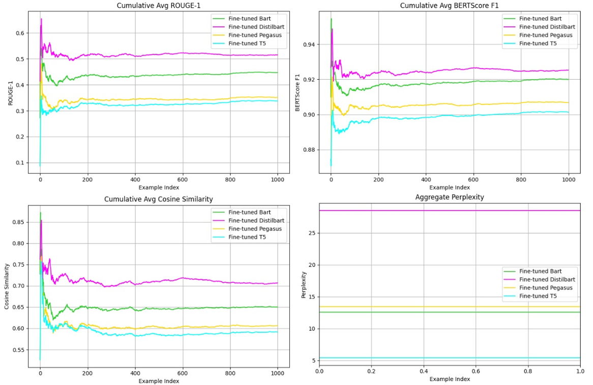
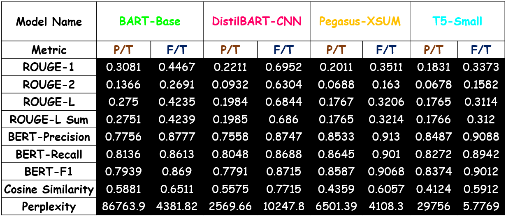
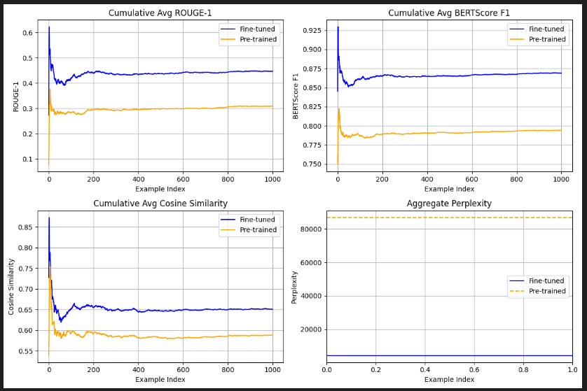
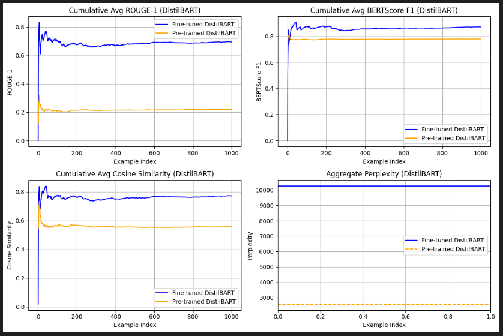
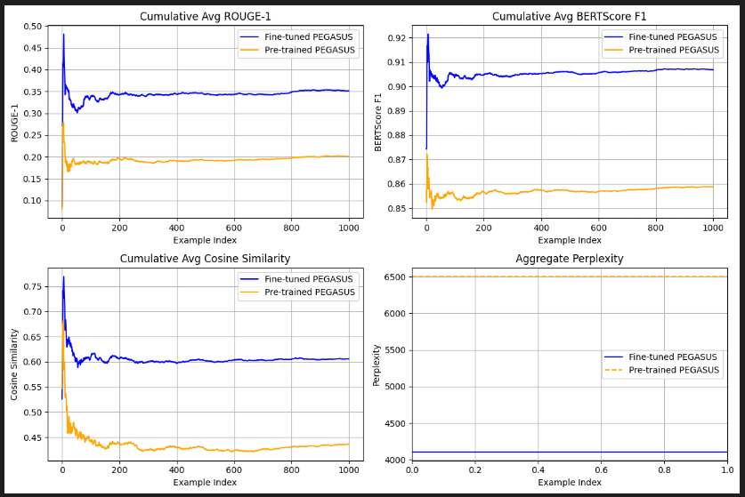
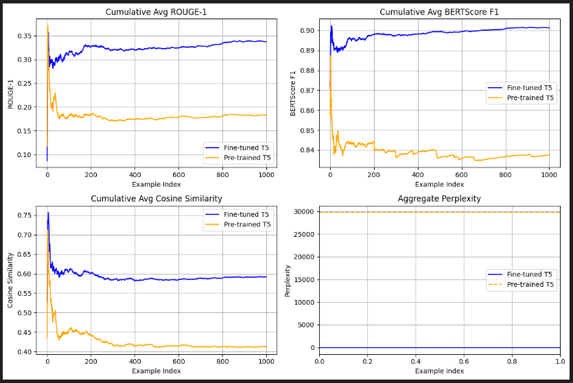

# Material Informatics for Graphene Research Using NLP

> Fine-tuning transformer-based language models on graphene scientific literature for automated knowledge extraction — abstractive summarisation and domain-specific question answering.

**Project Type:** NLP / Transfer Learning / Domain Adaptation  
**Institution:** Amrita School of Artificial Intelligence, Amrita Vishwa Vidyapeetham, Coimbatore  
**Programme:** B.Tech – Artificial Intelligence and Data Science (Batch of 2028)  
**Supervisor:** Dr. Kritesh K. Gupta, Assistant Professor — Center for Computational Engineering and Networking (CEN)

---

## About This Repository

This is my personal implementation repository for the 2nd semester project on Material Informatics using NLP. The project fine-tunes and benchmarks four transformer-based language models on a domain-specific graphene research corpus sourced from Scopus, demonstrating how NLP can accelerate scientific knowledge extraction in the materials science domain.

---

## Author

**T. Muthu Raam**  
B.Tech – Artificial Intelligence and Data Science  
Amrita School of Engineering, Coimbatore  
GitHub: [@Muthu142006](https://github.com/Muthu142006)

---

## Project Summary

Graphene research literature is large, complex, and growing rapidly. Manually reading and extracting insights from hundreds of abstracts is time-consuming for researchers. This project builds an NLP pipeline that:

- Automatically summarises graphene research abstracts
- Answers domain-specific questions about graphene properties and applications
- Compares four state-of-the-art transformer models to identify which is best suited for which task

---

## Models Used

| Model | HuggingFace ID | Best Suited For |
|-------|---------------|-----------------|
| BART-Base | `facebook/bart-base` | General-purpose summarisation + Q&A |
| DistilBART-CNN | `sshleifer/distilbart-cnn-6-6` | Summarisation (highest ROUGE) |
| Pegasus-XSUM | `google/pegasus-xsum` | Semantic summarisation (highest BERTScore) |
| T5-Small | `t5-small` | Q&A tasks (best fluency, lowest perplexity) |

---

## Dataset

**Graphene Corpora** sourced from Scopus:

| File | Description |
|------|-------------|
| `abstract_summaries_gptstyle.csv` | Graphene research abstracts with summaries |
| `qanda.csv` | 1000 graphene-related Q&A pairs |

- Total entries: ~1200
- Train / Test split: 80% / 20% (seed = 42)
- Max input tokens: 128 | Max output tokens: 32

> Dataset not included in this repo due to licensing. Source from [Scopus](https://www.scopus.com/).

---

## Results

### Evaluation Summary (Post Fine-Tuning vs Pre-Trained)

| Metric | BART-Base | DistilBART-CNN | Pegasus-XSUM | T5-Small |
|--------|-----------|----------------|--------------|----------|
| ROUGE-1 | 0.3081 → **0.4467** | 0.2211 → **0.6952** | 0.2011 → **0.3511** | 0.1831 → **0.3373** |
| ROUGE-2 | 0.1366 → **0.2691** | 0.0932 → **0.6304** | 0.0688 → **0.1630** | 0.0678 → **0.1582** |
| ROUGE-L | 0.2750 → **0.4235** | 0.1984 → **0.6844** | 0.1767 → **0.3206** | 0.1765 → **0.3114** |
| BERT-F1 | 0.7939 → **0.8690** | 0.7791 → **0.8715** | 0.8587 → **0.9068** | 0.8374 → **0.9012** |
| Cosine Sim | 0.5881 → **0.6511** | 0.5575 → **0.7715** | 0.4359 → **0.6057** | 0.4124 → **0.5912** |
| Perplexity | 86763.9 → **4381.82** | 2569.66 → **10247.8** | 6501.39 → **4108.30** | 29756.0 → **5.7769** |

### Key Findings

- **DistilBART-CNN** — ROUGE-1 improved by **+214%** post fine-tuning. Best for summarisation tasks requiring lexical accuracy.
- **Pegasus-XSUM** — Highest BERT-F1 (**0.9068**). Best at capturing semantic meaning.
- **T5-Small** — Lowest perplexity (**5.77**). Most fluent and natural outputs. Best for Q&A.
- **BART-Base** — Most balanced performance across all metrics. Strong general-purpose baseline.
- All fine-tuned models significantly outperformed their pre-trained baselines.

### Cumulative Performance Plot (All Models — 1000 Q&A Pairs)



### Evaluation Table



---

## Per-Model Evaluation Plots

<table>
<tr>
<td><strong>BART-Base</strong><br></td>
<td><strong>DistilBART-CNN</strong><br></td>
</tr>
<tr>
<td><strong>Pegasus-XSUM</strong><br></td>
<td><strong>T5-Small</strong><br></td>
</tr>
</table>

---

## Training Configuration

```python
TrainingArguments(
    num_train_epochs        = 5,
    per_device_train_batch_size = 2,
    gradient_accumulation_steps = 2,   # Effective batch size = 4
    learning_rate           = 5e-5,
    weight_decay            = 0.01,
    fp16                    = True,    # Half-precision for memory efficiency
    gradient_checkpointing  = True,    # Saves GPU memory
)
# Beam search during inference: num_beams = 4
```

**Memory optimisations used:** FP16, gradient accumulation, gradient checkpointing, `torch.cuda.empty_cache()`

---

## Repository Structure

```
graphene-nlp-materialinformatics/
│
├── notebooks/
│   ├── FT_LLM_BARTBASE.ipynb
│   ├── FT_LLM_DISTILBART.ipynb
│   ├── FT_LLM_PEGASUS-XSUM.ipynb
│   └── FT_LLM_T5-SMALL.ipynb
│
├── images/
│   ├── all_model_comparison.png
│   ├── evaluation_table.png
│   ├── bartbase_output.png
│   ├── distilbart_output.png
│   ├── pegasus_output.png
│   ├── t5_output.png
│   └── test_data_output.jpg
│
├── data/
│   └── README.md
│
├── requirements.txt
├── .gitignore
└── README.md
```

---

## Setup & Usage

```bash
# 1. Clone the repo
git clone https://github.com/Muthu142006/graphene-nlp-materialinformatics.git
cd graphene-nlp-materialinformatics

# 2. Install dependencies
pip install -r requirements.txt

# 3. Add your dataset files to data/ folder
# 4. Open any notebook in Jupyter or Google Colab and run
```

> Recommended: Run on Google Colab with T4 GPU

---

## Tech Stack

`Python` · `PyTorch` · `HuggingFace Transformers` · `HuggingFace Datasets` · `evaluate` · `bert-score` · `sentence-transformers` · `pandas` · `matplotlib`

---

## Future Work

- Expand dataset to other 2D materials (MoS2, h-BN, perovskites)
- Experiment with larger models: BART-Large, T5-Base
- Implement Retrieval-Augmented Generation (RAG) for real-time knowledge retrieval
- Deploy as a web-based Q&A interface for materials science researchers

---

## References

1. Lewis et al. (2020). BART: Denoising Sequence-to-Sequence Pre-training. *ACL 2020*. [arXiv:1910.13461](https://arxiv.org/abs/1910.13461)
2. Zhang et al. (2020). PEGASUS: Pre-training with Extracted Gap-sentences. *ICML 2020*. [arXiv:1912.08777](https://arxiv.org/abs/1912.08777)
3. Raffel et al. (2020). Exploring the Limits of Transfer Learning with T5. *JMLR*. [arXiv:1910.10683](https://arxiv.org/abs/1910.10683)
4. Sanh et al. (2019). DistilBERT, a distilled version of BERT. *NeurIPS Workshop*. [arXiv:1910.01108](https://arxiv.org/abs/1910.01108)

---

*Project completed: April 2025 | Amrita School of Engineering, Coimbatore*
